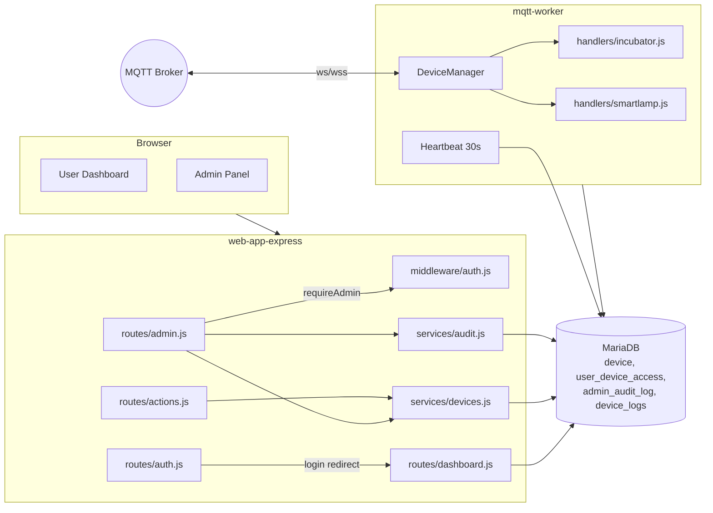
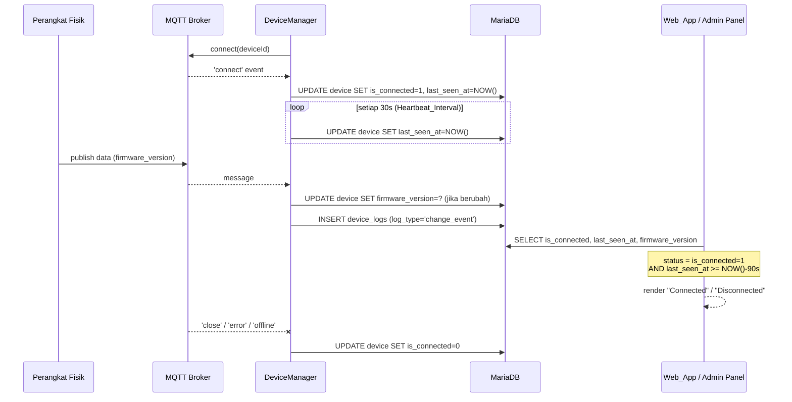
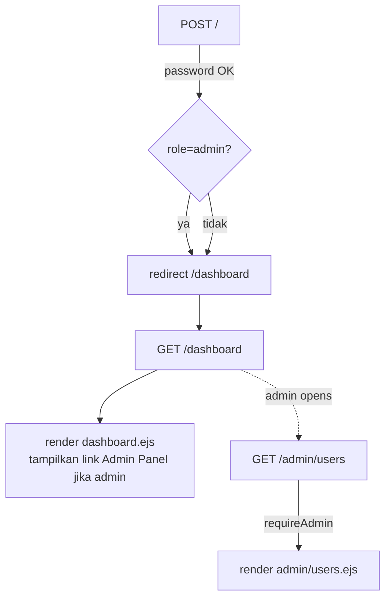

# Design Document

## Overview

Fitur **admin-user-device-management** memperluas dashboard UNIMONMQ dengan kemampuan administrasi perangkat penuh oleh admin, kemampuan sharing dan transfer kepemilikan oleh user owner, dan visibilitas status koneksi broker MQTT serta versi firmware per perangkat. Fitur ini juga menyelaraskan alur navigasi pasca-login admin agar admin dapat melihat dashboard utama (`/dashboard`) seperti user biasa, sementara halaman `/admin/*` tetap eksklusif untuk admin.

Fitur dibangun di atas tiga komponen yang sudah ada di repo:

- **Web_App** (`web-app-express/`) — Express 4 + EJS, membaca/menulis ke MariaDB melalui pool `mysql2/promise`, mengandalkan middleware `requireLogin`/`requireAdmin` dan helper `insertAdminAuditLog`.
- **MQTT_Worker** (`mqtt-worker/`) — singleton `DeviceManager` yang membuka koneksi MQTT per perangkat, kini diperluas dengan tracking status koneksi (`is_connected`, `last_seen_at`) dan ekstraksi `firmware_version` dari payload.
- **MariaDB** — kolom baru di tabel `device` (`firmware_version`, `is_connected`, `last_seen_at`) di-ensure runtime di `services/devices.js` dan didokumentasikan sebagai migration baru.

Tidak ada channel komunikasi langsung antara `Web_App` dan `MQTT_Worker`. Pertukaran status mengikuti pola repo yang sudah ada, yaitu melalui MariaDB sebagai shared state.

### Tujuan Desain

- Mempertahankan konvensi repo: parameterized query `?`, `try/catch (err) { next(err); }`, toast via `req.session.toast`, audit log via `insertAdminAuditLog`.
- Tidak memperkenalkan dependency baru (tidak ada library tambahan di `package.json` kedua service).
- Schema change yang baru harus idempoten (auto-ensure di runtime + file migration `database/migrations/002_*.sql`).
- Owner-driven actions (sharing dan transfer ownership) tidak menulis ke `admin_audit_log` — tabel itu khusus aksi admin.

## Architecture

### Diagram Komponen



### Alur Status Koneksi (Worker → DB → Web)



### Alur Login Admin



Perubahan ini menggantikan logika `redirectIfAuthed` dan login handler di `routes/auth.js` yang saat ini selalu mengarahkan admin ke `/admin/users`. Setelah perubahan, admin yang login (atau sudah authed) selalu mendarat di `/dashboard`. Halaman dashboard itu sendiri menjalankan query daftar perangkat berbasis `req.session.user.user_id` apa pun rolenya, dan menampilkan tombol/tautan "Admin Panel" hanya jika role admin.

## Components and Interfaces

### 1. `web-app-express/src/middleware/auth.js`

Tidak ada perubahan tanda tangan fungsi. Hanya menyesuaikan `redirectIfAuthed`:

- `redirectIfAuthed(req, res, next)` — selalu redirect ke `/dashboard` untuk user yang sudah authed (admin maupun user biasa). Sebelumnya bercabang berdasarkan role.
- `requireAdmin(req, res, next)` — tetap. Untuk user non-admin: set `req.session.toast = { type: 'error', message: 'Access Denied: Admin only area.' }` lalu redirect ke `/dashboard`.

### 2. `web-app-express/src/routes/auth.js`

- `POST /` — setelah autentikasi sukses, redirect tunggal: `res.redirect('/dashboard')`. Hilangkan branching ke `/admin/users`.
- Sisanya (register, logout, remember-me) tidak berubah.

### 3. `web-app-express/src/routes/dashboard.js`

- `GET /` — hapus early-return `if (req.session.user.role === 'admin') return res.redirect('/admin/users')`. Render template yang sama untuk semua role.
- Query daftar perangkat tetap: `device` yang `user_id = ?` UNION dengan `user_device_access`. Untuk admin, query yang sama akan menampilkan perangkat yang admin miliki/yang dishare ke admin (bukan semua perangkat di sistem; halaman seluruh-perangkat ada di `/admin/devices`).
- Tambahkan ke setiap row: kolom virtual `is_connected_effective` yang dihitung sebagai `is_connected = 1 AND last_seen_at >= NOW() - INTERVAL 90 SECOND`, untuk dipakai badge di kartu.

### 4. `web-app-express/src/views/dashboard.ejs`

Tambahan UI pada setiap kartu perangkat:

- **Status badge** kecil "Connected" / "Disconnected" di pojok kartu (warna hijau / abu-abu).
- **Kebab menu** (titik tiga) di pojok kanan atas kartu, hanya muncul jika `device.access_type === 'owner'`. Menu memuat:
  - Item **Share** → membuka modal `#shareModal` dengan input `target_username` (text). `access_type` di-set otomatis ke `viewer` (sesuai requirement, dropdown hanya berisi `viewer`).
  - Sublist **Active Viewers** → list user dengan baris di `user_device_access` untuk perangkat tersebut. Setiap entry punya tombol **Cabut Akses** yang submit form ke `POST /actions/revoke_share`.
  - Item **Transfer Ownership** → membuka modal `#transferModal` dengan input `target_username` dan checkbox `keep_as_viewer`.
- Untuk kartu shared (non-owner), tetap pakai tombol "remove shared" yang sudah ada.

JavaScript tambahan: helper modal open/close yang konsisten dengan `openNewDeviceModal()` yang sudah ada. Tidak menambah dependency front-end.

### 5. `web-app-express/src/routes/actions.js`

Endpoint baru (semua di-guard dengan `requireLogin`):

- `POST /actions/share_device`
  - Body: `device_id`, `target_username`.
  - Validasi: requester adalah owner (`device.user_id === req.session.user.user_id`), target user ada, target ≠ owner, belum punya baris `user_device_access` untuk device tersebut.
  - Operasi: `INSERT INTO user_device_access (user_id, device_id, access_type) VALUES (?, ?, 'viewer')`.
  - Pada kegagalan otorisasi: `res.status(403)` + redirect dashboard dengan toast error.
  - **Tidak** menulis `admin_audit_log` (dipicu user, bukan admin).

- `POST /actions/revoke_share`
  - Body: `device_id`, `viewer_user_id`.
  - Validasi: requester adalah owner perangkat.
  - Operasi: `DELETE FROM user_device_access WHERE user_id = ? AND device_id = ?`.
  - Hanya menghapus baris bertipe `viewer`; pencegahan via `WHERE` dengan `access_type = 'viewer'`.

- `POST /actions/transfer_ownership`
  - Body: `device_id`, `target_username`, `keep_as_viewer` (checkbox → `'on'` atau undefined).
  - Validasi: requester adalah owner, target user ada, target ≠ owner saat ini.
  - Operasi (single transaksi):
    1. `UPDATE device SET user_id = ? WHERE device_id = ?`.
    2. `DELETE FROM user_device_access WHERE user_id = ? AND device_id = ?` (target).
    3. `DELETE FROM user_device_access WHERE user_id = ? AND device_id = ?` (old owner) — selalu, untuk reset.
    4. Jika `keep_as_viewer === 'on'`: `INSERT INTO user_device_access (user_id, device_id, access_type) VALUES (?, ?, 'viewer')` untuk old owner.
  - Toast `success`, redirect ke `/dashboard`. **Tidak** menulis `admin_audit_log`.

Endpoint `POST /actions/redeem_serial_number` dan `POST /actions/remove_shared` yang sudah ada tidak diubah.

### 6. `web-app-express/src/routes/admin.js`

Diperluas tanpa mengubah file yang sudah ada secara struktural:

- `GET /admin/devices` — query SELECT diperluas untuk membaca `firmware_version`, `is_connected`, `last_seen_at`. Hitung `connected_effective = is_connected = 1 AND TIMESTAMPDIFF(SECOND, last_seen_at, NOW()) <= 90`. Kirim ke template.
- `POST /admin/devices` — handler `add_device`, `edit_device`, `delete_device` yang sudah ada tetap, audit log tetap dipanggil.
- `POST /admin/devices` — tambahkan branch `change_owner`:
  - Body: `change_owner=1`, `device_id`, `new_owner_id`.
  - Validasi: device ada, target user ada, `new_owner_id !== current owner`.
  - Transaksi: `UPDATE device.user_id`, `DELETE FROM user_device_access WHERE user_id = new_owner_id AND device_id = ?`.
  - `insertAdminAuditLog(adminId, 'change_owner', 'device', deviceId, { old_owner_id, new_owner_id })`.

Endpoint baru:

- `GET /admin/devices/:deviceId/access` — render template `admin/device_access.ejs`. Data:
  - Owner (dari `device.user_id` JOIN `user`).
  - Semua baris `user_device_access` JOIN `user` untuk device tersebut.
  - Untuk setiap baris: `user_id`, `user_name`, `access_type`, `granted_at` (formatted).
- `POST /admin/devices/:deviceId/access/revoke`
  - Body: `viewer_user_id`.
  - Operasi: `DELETE FROM user_device_access WHERE user_id = ? AND device_id = ? AND access_type = 'viewer'`.
  - `insertAdminAuditLog(adminId, 'revoke_access', 'device', deviceId, { revoked_user_id })`.

### 7. `web-app-express/src/views/admin/devices.ejs`

Tambahan kolom tabel:

- **Firmware** — render `device.firmware_version || 'unknown'`.
- **Connection** — badge berwarna berdasarkan `connected_effective`:
  - `true` → "Connected" (hijau).
  - `false` → "Disconnected" (abu-abu).
- **Last Seen** — `device.last_seen_at` di-format relatif (mis. "2m ago") atau "Belum pernah terhubung" jika `NULL`. Karena tidak ada library tanggal di repo, gunakan helper inline kecil di EJS.
- **Owner button** baru per row — membuka modal `#changeOwnerModal` (form submit ke `POST /admin/devices` dengan `change_owner=1`).
- **Access link** — link `Access` per row yang menuju `/admin/devices/:deviceId/access`.

### 8. `web-app-express/src/views/admin/device_access.ejs` (baru)

- Heading: nama perangkat + serial.
- Tabel akses: `user_id`, `user_name`, `access_type`, `granted_at`, dan tombol "Cabut Akses" (hanya untuk baris `viewer`).
- Jika tidak ada baris di `user_device_access`, tampilkan label "Tidak ada user lain yang memiliki akses".

### 9. `web-app-express/src/services/devices.js`

Perluas `ensureAdminDeviceTables()` agar idempoten menambahkan kolom dan indeks baru pada `device`:

```js
if (!(await columnExists('device', 'firmware_version'))) {
  await pool.query("ALTER TABLE `device` ADD COLUMN `firmware_version` varchar(50) DEFAULT NULL");
}
if (!(await columnExists('device', 'is_connected'))) {
  await pool.query("ALTER TABLE `device` ADD COLUMN `is_connected` tinyint(1) NOT NULL DEFAULT 0");
}
if (!(await columnExists('device', 'last_seen_at'))) {
  await pool.query("ALTER TABLE `device` ADD COLUMN `last_seen_at` datetime DEFAULT NULL");
}
if (!(await indexExists('device', 'device_is_connected'))) {
  try { await pool.query("ALTER TABLE `device` ADD KEY `device_is_connected` (`is_connected`)"); }
  catch (err) { console.error('Index ensure failed:', err.message); }
}
```

Setiap statement dibungkus pola `try/catch` yang sama dengan baris-baris ALTER yang sudah ada di file ini, sehingga kegagalan satu statement tidak menghentikan startup.

Tambahan helper:

- `computeConnectionStatus(row)` — utilitas opsional yang mengubah `(is_connected, last_seen_at)` menjadi string `"Connected"`/`"Disconnected"` di sisi server, dipakai oleh route admin/dashboard agar logika 90 detik tidak duplikat.

### 10. `database/migrations/002_device_status_firmware.sql` (baru)

```sql
ALTER TABLE `device` ADD COLUMN IF NOT EXISTS `firmware_version` varchar(50) DEFAULT NULL;
ALTER TABLE `device` ADD COLUMN IF NOT EXISTS `is_connected` tinyint(1) NOT NULL DEFAULT 0;
ALTER TABLE `device` ADD COLUMN IF NOT EXISTS `last_seen_at` datetime DEFAULT NULL;
CREATE INDEX IF NOT EXISTS `device_is_connected` ON `device` (`is_connected`);
```

Idempoten karena memakai `IF NOT EXISTS` (didukung MariaDB).

### 11. `mqtt-worker/src/services/DeviceManager.js`

Penambahan tanpa breaking change pada method publik.

State internal baru:

- `this.heartbeatTimer` — `setInterval` global dengan periode `30_000` ms; saat tick, untuk setiap `deviceId` dengan client terhubung, jalankan `UPDATE device SET last_seen_at = NOW() WHERE device_id = ?`.
- `this.connectedDeviceIds` — `Set<string>` yang dipelihara via event `connect`/`close`/`offline`/`error`, sehingga heartbeat hanya menulis untuk yang benar-benar connected.

Hook MQTT baru di `connectDevice(device)`:

- `client.on('connect', ...)` — selain subscribe topik yang sudah ada, jalankan:
  - `UPDATE device SET is_connected = 1, last_seen_at = NOW() WHERE device_id = ?`.
  - `this.connectedDeviceIds.add(String(device.device_id))`.
- `client.on('close', cb)`, `client.on('error', cb)`, `client.on('offline', cb)` — sebut helper internal `markDisconnected(deviceId)` yang menjalankan:
  - `UPDATE device SET is_connected = 0 WHERE device_id = ?` (TANPA mengubah `last_seen_at`).
  - `this.connectedDeviceIds.delete(String(deviceId))`.
- Setiap UPDATE dibungkus `try/catch` dan error dialihkan ke `console.error`. Tidak melempar.

Perluasan `syncDevices()`:

- Saat sebuah `device_id` dihapus dari hasil `SELECT * FROM device`, panggil `client.end()` dan hapus dari `mqttClients`/`deviceBuffers`/`connectedDeviceIds`. **Jangan** menulis ke `device.is_connected` karena baris device sudah tidak ada (sesuai requirement 8.4).

Boot:

- `index.js` perlu menjalankan `deviceManager.startHeartbeat()` sekali setelah initial sync. Saat shutdown, `gracefulShutdown()` clear interval.

### 12. `mqtt-worker/src/handlers/incubator.js` & `smartlamp.js`

Tambahkan helper bersama (atau inline di tiap handler) `maybeUpdateFirmwareVersion(device, data)`:

```js
async function maybeUpdateFirmwareVersion(device, data) {
  const fw = data && typeof data.firmware_version === 'string'
    ? data.firmware_version.trim()
    : '';
  if (!fw) return; // requirement 9.4 / 9.5
  const [rows] = await pool.query(
    'SELECT firmware_version FROM device WHERE device_id = ? LIMIT 1',
    [device.device_id]
  );
  const current = rows[0]?.firmware_version || null;
  if (current === fw) return;
  await pool.query(
    'UPDATE device SET firmware_version = ? WHERE device_id = ?',
    [fw, device.device_id]
  );
  await pool.query(
    'INSERT INTO device_logs (device_id, data, log_type) VALUES (?, ?, ?)',
    [
      device.device_id,
      JSON.stringify({ type: 'firmware_version', old: current, new: fw }),
      'change_event'
    ]
  );
}
```

Dipanggil di awal `handleIncubator` dan `handleSmartlamp` setelah `JSON.parse` sukses. Karena DeviceManager sudah membungkus `JSON.parse` dengan `try/catch` (cek `client.on('message', ...)`), payload non-JSON akan ter-skip secara alami (requirement 9.3).

## Data Models

### Tabel `device` (kolom yang ditambah)

| Kolom              | Tipe              | Default | Catatan                                                              |
| ------------------ | ----------------- | ------- | -------------------------------------------------------------------- |
| `firmware_version` | `varchar(50)`     | `NULL`  | Diset oleh worker dari payload JSON saat berbeda dari nilai sekarang |
| `is_connected`     | `tinyint(1)`      | `0`     | `1` saat client MQTT punya event `connect` aktif                     |
| `last_seen_at`     | `datetime`        | `NULL`  | Diperbarui pada `connect` event dan setiap 30 detik selama terhubung |

Index baru: `KEY device_is_connected (is_connected)`.

### Tabel `user_device_access` (tidak berubah, dipakai lebih luas)

```text
(user_id, device_id, access_type ∈ {'owner','viewer'}, redeemed_via_token_id, granted_at)
UNIQUE KEY user_device (user_id, device_id)
```

Konvensi yang diperkuat:

- Untuk feature ini, baris dengan `access_type = 'owner'` di tabel ini opsional/tidak diperlukan: kepemilikan adalah `device.user_id`. Sharing memakai `access_type = 'viewer'`.
- Saat transfer ownership, baris (target_user, device_id) di-`DELETE` dulu untuk menghindari konflik dengan `UNIQUE KEY user_device`.

### Tabel `admin_audit_log` (tidak berubah, dipakai lebih luas)

`action` value yang relevan untuk fitur ini:

- `add_device`, `edit_device`, `delete_device`, `change_owner`, `revoke_access` (target_type=`device`).
- `change_role`, `delete_user` (target_type=`user`, sudah eksisting).

`details` JSON contoh:

```json
{ "old_owner_id": 11, "new_owner_id": 7 }
{ "revoked_user_id": 7 }
{ "name": "Inkubator Ternak 1", "old_serial": "A14C0F1E" }
```

### Payload MQTT yang dikenali

`incubator/{id}/data` dan `smartlamp/{id}/status` JSON, contoh field yang relevan:

```json
{ "temperature": 30.1, "humidity": 70.4, "firmware_version": "1.2.3" }
{ "power": "on", "firmware_version": "0.9.1" }
```

Field di luar `firmware_version` ditangani handler eksisting (tidak diubah).


## Correctness Properties

*A property is a characteristic or behavior that should hold true across all valid executions of a system — essentially, a formal statement about what the system should do. Properties serve as the bridge between human-readable specifications and machine-verifiable correctness guarantees.*

Setiap properti di bawah merangkum hasil prework. Properti yang redundan sudah digabung pada langkah Property Reflection.

### Property 1: Add device menghasilkan device + serial unik + token akses

*For any* input form `add_device` yang valid (`device_name` non-empty, `device_type ∈ {'esp32-inkubator', 'esp32-smartlamp'}`, `broker_url` non-empty, `broker_port` non-empty, `owner_id` ada di tabel `user`), pemanggilan handler `add_device` SHALL menghasilkan tepat satu baris baru di `device` dengan field-field input yang sama dan `serial_number` mencocokkan regex `^[0-9A-F]{8}$` yang belum dipakai device lain, plus tepat satu baris baru di `device_access_tokens` untuk device tersebut dengan `max_uses = 1`.

**Validates: Requirements 1.1**

### Property 2: Edit device adalah write-then-read identitas

*For any* device existing dan input form `edit_device` valid (`device_id` ada, `device_type` valid, `owner_id` ada di tabel `user`), setelah handler edit dijalankan, `SELECT device_name, device_type, broker_url, broker_port, mq_user, mq_pass, user_id FROM device WHERE device_id = ?` SHALL mengembalikan nilai yang sama dengan input.

**Validates: Requirements 1.2**

### Property 3: Delete device cascade-bersih

*For any* device existing dengan jumlah baris terkait (di `user_device_access`, `device_access_tokens`, `device_logs`) berapa pun, setelah handler `delete_device` selesai sukses, hitungan baris di tabel-tabel tersebut yang menunjuk ke `device_id` itu SHALL = 0.

**Validates: Requirements 1.3**

### Property 4: Input invalid menyebabkan DB tidak berubah dan toast error

*For any* aksi pada admin/owner/user yang mengirim input gagal validasi (CRUD device, change_owner, share, revoke_share, transfer_ownership) — termasuk `device_type` tidak dikenal, `owner_id`/`new_owner_id`/`target_username` tidak ada, target == owner saat ini, target sudah punya akses — pemanggilan handler SHALL meninggalkan seluruh tabel (`device`, `user_device_access`, `admin_audit_log`, `device_access_tokens`, `device_logs`) tidak berubah dan menyetel `req.session.toast` bertipe `error`.

**Validates: Requirements 1.4, 2.4, 2.5, 6.4, 6.5, 7.3, 7.4**

### Property 5: Setiap mutasi admin sukses menulis tepat satu baris audit

*For any* aksi admin sukses pada `Admin_Panel` (`add_device`, `edit_device`, `delete_device`, `change_owner`, `revoke_access`, `change_role`, `delete_user`), tepat satu baris baru SHALL muncul di `admin_audit_log` dengan `admin_id = req.session.user.user_id`, `action` sesuai aksinya, `target_type ∈ {'device','user'}` sesuai aksi, `target_id` menunjuk objek yang dimutasi, dan `details` berbentuk JSON non-null yang menyebutkan field-yang-diubah.

**Validates: Requirements 1.5, 2.3, 3.5, 11.1, 11.2**

### Property 6: Akses ke `/admin/*` ditolak untuk user non-admin

*For any* request HTTP ke path apapun di bawah `/admin/*` (GET maupun POST) yang berasal dari sesi dengan `role = 'user'` atau tanpa sesi, response SHALL berupa redirect 302 ke `/dashboard` (atau `/` jika belum login) dan tabel database SHALL tidak berubah.

**Validates: Requirements 1.6, 3.4, 4.6**

### Property 7: Change owner mengubah `device.user_id` dan menghapus duplikasi viewer

*For any* device existing, current owner `O`, dan `new_owner_id = N` dengan `N ∈ user.user_id` dan `N ≠ O`, setelah handler `change_owner` sukses (admin yang memicu), `device.user_id` SHALL = `N` dan tidak boleh ada baris di `user_device_access` untuk pasangan `(N, device_id)`.

**Validates: Requirements 2.1, 2.2**

### Property 8: Halaman akses perangkat menampilkan owner ∪ semua user_device_access

*For any* device existing dan request admin ke `GET /admin/devices/:deviceId/access`, daftar baris yang dirender SHALL = `{owner row dari device.user_id} ∪ {semua baris user_device_access untuk device_id}`, masing-masing baris memuat `user_id`, `user_name`, `access_type ∈ {'owner','viewer'}`, dan `granted_at`. Bila tidak ada baris di `user_device_access`, view SHALL menampilkan label "Tidak ada user lain yang memiliki akses".

**Validates: Requirements 3.1, 3.2, 3.3**

### Property 9: Login admin mendarat di dashboard, dengan link Admin Panel

*For any* sesi/permintaan dengan `role = 'admin'` (baik baru login melalui `POST /` maupun sudah authed), redirect setelah autentikasi/saat membuka `/` SHALL menuju `/dashboard`, dan response render `/dashboard` SHALL memuat tautan `href="/admin/users"` (Admin Panel).

**Validates: Requirements 4.1, 4.2, 4.3, 4.5**

### Property 10: Halaman `/admin/*` valid bekerja untuk admin

*For any* path `/admin/users`, `/admin/devices`, `/admin/devices/:id/access` dan request dari sesi admin yang valid, response SHALL berupa render template admin yang sesuai (status 200) dan tidak meredirect ke `/dashboard`.

**Validates: Requirements 4.4**

### Property 11: Status koneksi efektif = is_connected=1 AND last_seen_at dalam 90 detik

*For any* nilai `(is_connected ∈ {0,1}, last_seen_at)` yang mungkin dan `now`, fungsi `computeConnectionStatus(is_connected, last_seen_at, now)` SHALL mengembalikan `"Connected"` jika dan hanya jika `is_connected = 1` DAN `last_seen_at IS NOT NULL` DAN `(now - last_seen_at) ≤ 90` detik; `"Disconnected"` selainnya.

**Validates: Requirements 5.2, 5.3**

### Property 12: Tabel `/admin/devices` selalu menampilkan firmware dan last_seen yang dapat dibaca

*For any* daftar perangkat di response `GET /admin/devices`, setiap baris SHALL menampilkan teks firmware (= `device.firmware_version` jika non-null/non-empty, `"unknown"` selain itu) dan teks last seen (= format human-readable dari `last_seen_at` jika non-null, `"Belum pernah terhubung"` jika null).

**Validates: Requirements 5.1, 5.4**

### Property 13: Halaman admin/devices selalu membaca DB segar

*For any* dua request `GET /admin/devices` berurutan dengan state DB berubah di antaranya (mis. nilai `is_connected`/`last_seen_at`/`firmware_version` berubah), output yang dirender pada request kedua SHALL mencerminkan nilai DB terbaru, tanpa cache hit dan tanpa restart proses.

**Validates: Requirements 5.5**

### Property 14: Kebab menu owner dirender pada setiap kartu owner di dashboard

*For any* device dengan `access_type = 'owner'` di hasil dashboard untuk seorang user, response HTML SHALL berisi kebab menu untuk device tersebut dengan opsi Share dan Transfer Ownership, serta daftar viewer aktif untuk device itu beserta tombol "Cabut Akses" untuk masing-masing viewer.

**Validates: Requirements 6.1, 6.2, 6.7**

### Property 15: Share device menambah baris viewer; revoke share menghapusnya

*For any* device yang dimiliki user `O` dan target user `T ≠ O` yang ada di tabel `user` dan belum punya baris di `user_device_access` untuk device tersebut, setelah `POST /actions/share_device` sukses, baris `(T, device_id, 'viewer')` SHALL ada. Sebaliknya, *for any* baris viewer existing `(T, device_id, 'viewer')` pada device milik `O`, setelah `POST /actions/revoke_share` sukses oleh `O`, baris itu SHALL tidak ada.

**Validates: Requirements 6.3, 6.8**

### Property 16: Aksi sharing/transfer dari non-owner ditolak 403 dan tidak mengubah DB

*For any* request `POST /actions/share_device`, `POST /actions/revoke_share`, atau `POST /actions/transfer_ownership` di mana `req.session.user.user_id ≠ device.user_id`, response status SHALL = 403 dan seluruh tabel database SHALL tidak berubah.

**Validates: Requirements 6.6, 7.2**

### Property 17: Transfer ownership memindah owner dan opsional menyisakan viewer

*For any* device milik `O`, target user `T` dengan `T ∈ user.user_id` dan `T ≠ O`, dan flag `keep_as_viewer ∈ {true, false}`, setelah `POST /actions/transfer_ownership` sukses (dipicu owner) dalam satu transaksi: `device.user_id` SHALL = `T`; tidak ada baris `user_device_access` untuk `(T, device_id)`; baris `(O, device_id, 'viewer')` SHALL ada jika dan hanya jika `keep_as_viewer = true`. Setelah aksi sukses, response SHALL berupa redirect ke `/dashboard` dengan toast bertipe `success`.

**Validates: Requirements 7.1, 7.5, 7.7**

### Property 18: Aksi user (sharing/transfer) tidak menulis admin_audit_log

*For any* aksi `share_device`, `revoke_share`, atau `transfer_ownership` yang dipicu oleh user owner (bukan admin), jumlah baris `admin_audit_log` SHALL tidak berubah antara sebelum dan sesudah aksi (terlepas dari sukses atau gagal).

**Validates: Requirements 7.6, 11.4**

### Property 19: Worker melaporkan koneksi: connect → is_connected=1+last_seen_at fresh; close/error/offline → is_connected=0 tanpa mengubah last_seen_at

*For any* device yang client MQTT-nya memicu event `connect`, setelah handler event selesai, `device.is_connected` SHALL = 1 dan `device.last_seen_at` SHALL berada dalam beberapa detik dari `NOW()`. *For any* device yang client-nya memicu event `close`, `error`, atau `offline`, setelah handler event selesai, `device.is_connected` SHALL = 0 dan `device.last_seen_at` SHALL identik dengan nilai sebelum event.

**Validates: Requirements 8.1, 8.2**

### Property 20: Heartbeat memperbarui `last_seen_at` pada device yang terhubung

*For any* simulasi waktu sepanjang `Heartbeat_Interval` (30 detik) sementara client MQTT untuk sebuah device tetap dalam state connected, `device.last_seen_at` SHALL diperbarui paling tidak satu kali ke nilai dalam `Heartbeat_Interval` detik dari waktu sekarang, untuk device tersebut dan tidak untuk device yang tidak terhubung.

**Validates: Requirements 8.3**

### Property 21: Worker tidak crash pada error DB

*For any* simulated DB error pada `pool.query` selama menulis status koneksi atau firmware (`UPDATE device ...`, `INSERT INTO device_logs ...`), `DeviceManager` SHALL tidak melempar exception ke caller, SHALL menulis pesan error ke `console.error`, dan SHALL melanjutkan menerima event berikutnya.

**Validates: Requirements 8.5**

### Property 22: Firmware update hanya saat string non-kosong dan berbeda; selain itu no-op

*For any* payload MQTT yang sudah diparse `data` (objek JSON) dan device existing: jika `data.firmware_version` adalah string non-kosong dan berbeda dari `device.firmware_version` saat ini, setelah handler selesai `device.firmware_version` SHALL = `data.firmware_version` DAN baris baru SHALL ada di `device_logs` dengan `log_type = 'change_event'` dan `data = { type: 'firmware_version', old: <previous>, new: <data.firmware_version> }`. Jika `data.firmware_version` tidak ada, bukan string, atau string kosong/whitespace, `device.firmware_version` SHALL tidak berubah dan tidak ada baris baru di `device_logs`.

**Validates: Requirements 9.1, 9.2, 9.4, 9.5**

### Property 23: Payload non-JSON tidak mengubah firmware_version

*For any* pesan MQTT yang gagal `JSON.parse` (string non-JSON, byte acak), `device.firmware_version` SHALL tidak berubah, dan worker SHALL menulis pesan error ke `console.error` tanpa melempar.

**Validates: Requirements 9.3**

### Property 24: Schema device punya kolom dan index yang dispesifikasi

Setelah `ensureAdminDeviceTables()` atau migration `002_device_status_firmware.sql` dijalankan terhadap database fresh, `SHOW COLUMNS FROM device` SHALL memuat: `firmware_version VARCHAR(50) DEFAULT NULL`, `is_connected TINYINT(1) NOT NULL DEFAULT 0`, `last_seen_at DATETIME DEFAULT NULL`. `SHOW INDEX FROM device` SHALL memuat key bernama `device_is_connected` dengan kolom `is_connected`.

**Validates: Requirements 10.1, 10.2, 10.3, 10.6**

### Property 25: ensure/migration idempoten

*For any* state database (sudah pernah migrasi atau belum), menjalankan `ensureAdminDeviceTables()` dua kali berturut-turut SHALL menghasilkan state yang identik dengan menjalankannya satu kali (idempotence: `f(f(x)) = f(x)`). Hal yang sama berlaku untuk `database/migrations/002_device_status_firmware.sql`.

**Validates: Requirements 10.4, 10.5**

### Property 26: ensure tidak men-crash startup pada error ALTER

*For any* simulated kegagalan eksekusi salah satu `ALTER TABLE` di `ensureAdminDeviceTables()`, fungsi SHALL menulis pesan error ke `console.error` dan SHALL kembali normal (tidak melempar), sehingga proses Express dapat melanjutkan startup.

**Validates: Requirements 10.7**

### Property 27: Audit logger tidak melempar pada error DB

*For any* pemanggilan `insertAdminAuditLog(adminId, action, targetType, targetId, details)` di mana `pool.query` gagal, fungsi SHALL menulis pesan error ke `console.error` dan SHALL return tanpa melempar exception ke caller.

**Validates: Requirements 11.3**

## Error Handling

Pendekatan error handling mengikuti pola yang sudah ada di repo.

### Web App (`web-app-express`)

- Setiap route handler dibungkus dengan `try/catch (err) { next(err); }`. Global error handler di `app.js` menangkap exception yang lolos dan merespons HTTP 500.
- Validasi input dilakukan inline di handler. Pada gagal validasi: set `req.session.toast = { type: 'error', message: '...' }` dan `return res.redirect(...)`. Tidak melempar.
- Pada operasi multi-statement (misal CRUD device dengan dua tabel, change owner, transfer ownership): gunakan `pool.getConnection()` + `beginTransaction/commit/rollback` dan release di `finally`.
- Pada response 403 (sharing/transfer non-owner): kirim status 403 dengan body teks pendek atau redirect dashboard dengan toast error — pilih `res.status(403).redirect('/dashboard')` agar konsisten dengan pola toast.
- Audit log adalah best-effort: kegagalan `insertAdminAuditLog` di-log ke `console.error` dan tidak menggagalkan response sukses ke admin (sesuai kode existing di `services/audit.js`).

### MQTT Worker (`mqtt-worker`)

- DeviceManager tidak boleh crash pada error MariaDB. Setiap `pool.query` baru (untuk status koneksi, heartbeat, firmware) dibungkus `try/catch` dan dialihkan ke `console.error`.
- `JSON.parse` di event `message` sudah ada di kode existing di `try/catch`; handler firmware ikut-aman karena dipanggil di dalam blok itu.
- Pada penghapusan device oleh `syncDevices()`, worker memanggil `client.end()` saja; tidak melakukan `UPDATE device` karena baris sudah tidak ada (FK cascade akan menghapus `device_logs`).
- Pada shutdown: clear `heartbeatTimer`, `client.end()` semua client, lalu `pool.end()`.

### Skema/Boot

- `ensureAdminDeviceTables` membungkus tiap `ALTER TABLE` dalam `try/catch` agar kegagalan satu pernyataan tidak menggagalkan startup. Hal ini mengikuti baris yang sudah ada untuk `device_serial_number` dan `serial_number` index.
- File migration menggunakan `IF NOT EXISTS` untuk kolom dan index sehingga aman dijalankan ulang.

## Testing Strategy

Repo saat ini tidak punya test runner terpasang. Dokumen ini mendefinisikan strategi pengujian. Implementasinya akan diatur di `tasks.md`.

### Pendekatan Dual

- **Unit tests** menargetkan contoh konkret, jalur error, dan integrasi singkat (mis. SQL stub).
- **Property-based tests** menargetkan properti universal di section "Correctness Properties", dengan generator yang mencakup edge case (null `last_seen_at`, payload tanpa `firmware_version`, target user yang sama dengan owner, dsb).

### Library

- Web app dan worker keduanya Node.js CommonJS. Pilih satu library PBT yang ringan dan tidak butuh build step:
  - **fast-check** (`npm i -D fast-check`) — properti API sederhana, integrasi mudah dengan runner generic.
- Test runner: **node:test** (built-in di Node 18+) untuk menghindari menambah dependency runtime besar. Tidak ada build step.
- Baik di `web-app-express/` maupun `mqtt-worker/`, tambahkan `package.json` script: `"test": "node --test"`. Setiap service punya `node_modules`-nya sendiri (sesuai konvensi repo).

### Konfigurasi PBT

- Setiap property test minimal **100 iterasi** (`fc.assert(prop, { numRuns: 100 })`).
- Setiap property test ditandai komentar di atas blok test:
  - Format: `// Feature: admin-user-device-management, Property {N}: {property_text}`
- Setiap correctness property di atas diimplementasikan oleh **satu** property-based test.

### Test Database & Isolasi

- Untuk properti yang menyentuh DB (sebagian besar): gunakan database MariaDB yang sama dengan `docker-compose up`, dengan schema setup via `ensureAdminDeviceTables()` lalu rollback per-test menggunakan `BEGIN`/`ROLLBACK` di koneksi yang sama.
- Untuk properti murni computational (`computeConnectionStatus`, parsing firmware): tidak butuh DB.

### Pemetaan Property → Implementasi Test

| # | Lokasi test                                         | Catatan                                                                |
| - | --------------------------------------------------- | ---------------------------------------------------------------------- |
| 1 | `web-app-express/test/admin-devices.prop.test.js`   | Generator input add_device valid; assert serial regex + token row.     |
| 2 | `web-app-express/test/admin-devices.prop.test.js`   | Round-trip edit → SELECT.                                              |
| 3 | `web-app-express/test/admin-devices.prop.test.js`   | Generator state cascade penuh, lalu DELETE.                            |
| 4 | `web-app-express/test/validation.prop.test.js`      | Generator input invalid lintas endpoint.                               |
| 5 | `web-app-express/test/audit.prop.test.js`           | Audit row count delta.                                                 |
| 6 | `web-app-express/test/auth.prop.test.js`            | Generator path /admin/* + role user.                                   |
| 7 | `web-app-express/test/admin-devices.prop.test.js`   | change_owner state assertion.                                          |
| 8 | `web-app-express/test/admin-access.prop.test.js`    | render device_access page.                                             |
| 9 | `web-app-express/test/auth.prop.test.js`            | login admin → /dashboard + link admin panel.                           |
| 10 | `web-app-express/test/auth.prop.test.js`           | admin paths render.                                                    |
| 11 | `web-app-express/test/connection-status.test.js`   | Pure unit/property atas computeConnectionStatus.                       |
| 12 | `web-app-express/test/admin-devices.prop.test.js`  | Render firmware/last_seen text.                                        |
| 13 | `web-app-express/test/admin-devices.prop.test.js`  | Two consecutive GET dengan state DB diubah.                            |
| 14 | `web-app-express/test/dashboard.prop.test.js`      | Kebab menu existence on owner card.                                    |
| 15 | `web-app-express/test/sharing.prop.test.js`        | Share + revoke round-trip.                                             |
| 16 | `web-app-express/test/sharing.prop.test.js`        | Non-owner POST → 403.                                                  |
| 17 | `web-app-express/test/transfer.prop.test.js`       | Transfer ownership state assertion.                                    |
| 18 | `web-app-express/test/transfer.prop.test.js`       | admin_audit_log delta = 0 untuk aksi user.                             |
| 19 | `mqtt-worker/test/device-manager.prop.test.js`     | Simulate connect/close/error/offline events via stub `mqtt.connect`.   |
| 20 | `mqtt-worker/test/device-manager.prop.test.js`     | Heartbeat with fake timers.                                            |
| 21 | `mqtt-worker/test/device-manager.prop.test.js`     | Simulated `pool.query` rejection; assert no throw.                     |
| 22 | `mqtt-worker/test/firmware.prop.test.js`           | Generator payload firmware lintas tipe.                                |
| 23 | `mqtt-worker/test/firmware.prop.test.js`           | Generator string non-JSON.                                             |
| 24 | `web-app-express/test/schema.prop.test.js`         | SHOW COLUMNS / SHOW INDEX assertion.                                   |
| 25 | `web-app-express/test/schema.prop.test.js`         | Idempotence: jalankan ensure 2x.                                       |
| 26 | `web-app-express/test/schema.prop.test.js`         | Stub `pool.query` reject pada salah satu ALTER.                        |
| 27 | `web-app-express/test/audit.prop.test.js`          | Stub `pool.query` reject di insertAdminAuditLog.                       |

### Unit Tests Tambahan (selain property tests)

- Login redirect example: admin login dengan kredensial sample → 302 ke `/dashboard`.
- Empty access list view example: device tanpa `user_device_access` → render label "Tidak ada user lain yang memiliki akses".
- Format helper: `formatLastSeen(null)` → `"Belum pernah terhubung"`.
- Audit log stringify: `details` dirender sebagai JSON valid pada `admin_audit_log.details`.
